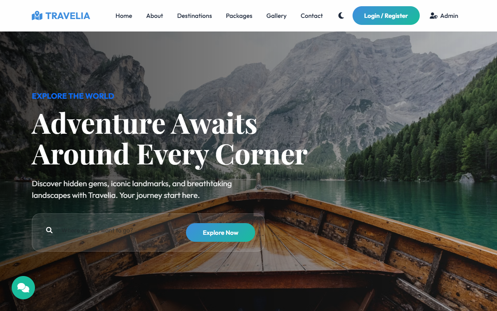
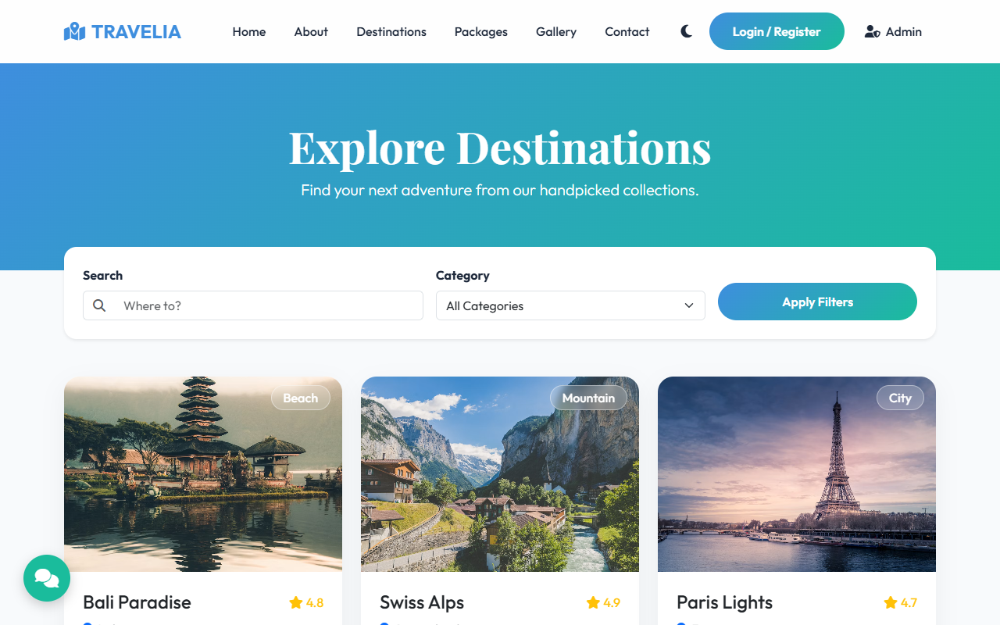
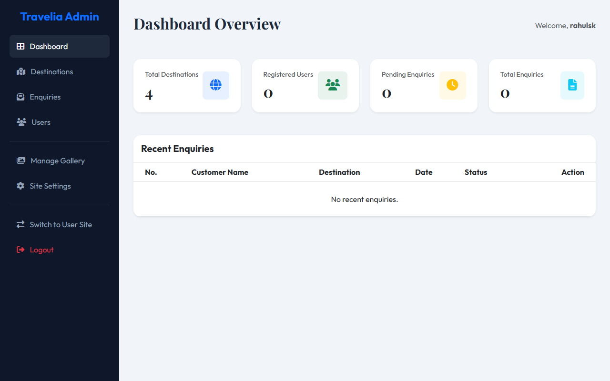

<div align="center">

# 🧭 Travelia — Tourism Destination Management System

**A full-stack travel portal with separate User and Admin dashboards, built with PHP 8 + MySQL.**

[](https://github.com/rahulskandagal/core-einstein/actions/workflows/ci.yml)
[](https://web-production-37f7b.up.railway.app)
[](#tech-stack)
[](#tech-stack)
[](#option-a--docker-one-command-works-anywhere)
[](LICENSE)

[**🌐 Open the live demo**](https://web-production-37f7b.up.railway.app) · [Admin panel](https://web-production-37f7b.up.railway.app/admin/) · [Report a bug](https://github.com/rahulskandagal/core-einstein/issues)

</div>

---

## Screenshots

| Home | Destinations |
|:---:|:---:|
|  |  |

| Admin dashboard |
|:---:|
|  |

## Features

**User side**
- Browse destinations with search + category filters, and detailed pages with pricing and best-time-to-visit
- Travel packages and photo gallery
- Register / login (bcrypt-hashed passwords), profile page
- Save destinations to a personal wishlist
- Send a booking enquiry (dates, group size, message) from any destination page
- Light / dark theme toggle

**Admin side**
- Dashboard with live counts (destinations, users, enquiries)
- Add, edit and delete destinations
- View enquiries and mark them handled
- Manage registered users
- One-click switch between the admin panel and the public site

**Engineering**
- Prepared statements everywhere user input reaches SQL
- Config via environment variables with sane local defaults
- Self-seeding Docker image: schema + sample data created on first boot, idempotent migrations after that
- CI runs a PHP syntax check and a full Docker smoke test (site up, admin login, SQL dump not exposed) on every push

## Two dashboards — User and Admin

| Dashboard | Who        | Login page         | What you can do |
|-----------|------------|--------------------|-----------------|
| **User**  | travellers | `/login.php`       | browse destinations & packages, save a wishlist, send enquiries, edit profile |
| **Admin** | site owner | `/admin/login.php` | add/edit/delete destinations, view & respond to enquiries, manage users |

- **User → Admin:** click **Admin** in the top navbar (or **Switch to Admin** in the user dropdown when logged in).
- **Admin → User:** click **Switch to User Site** in the admin sidebar.

User and admin sessions are independent, so you can be logged into both at once and hop back and forth.

### Demo logins

| Role  | Where            | Username | Password |
|-------|------------------|----------|----------|
| Admin | `/admin/`        | `rahulsk` | `1234`  |
| User  | `/register.php`  | create your own | |

> Sample credentials for the demo only — change them before deploying anywhere real.

## Run it locally

### Option A — Docker (one command, works anywhere)

Requires [Docker Desktop](https://www.docker.com/products/docker-desktop/).

```bash
git clone https://github.com/rahulskandagal/core-einstein.git
cd core-einstein
docker compose up
```

Once the containers are up, open these in your browser
(**local addresses — they only work on the machine where you ran `docker compose up`**):

| What        | Local address                  |
|-------------|--------------------------------|
| Website     | `http://localhost:8090`        |
| Admin panel | `http://localhost:8090/admin/` |
| phpMyAdmin  | `http://localhost:8091`        |

The database is created and seeded automatically on first start. Stop with `Ctrl+C`;
run `docker compose down -v` to wipe the database and start fresh.
If 8090/8091 are taken on your machine: `WEB_PORT=8095 PMA_PORT=8096 docker compose up`.

### Option B — XAMPP

1. Install [XAMPP](https://www.apachefriends.org/) and start **Apache** and **MySQL**.
2. Clone into `htdocs`:
   ```bash
   cd C:\xampp\htdocs
   git clone https://github.com/rahulskandagal/core-einstein.git
   ```
3. Import the database — either via phpMyAdmin (**Import** → `database/tourism_db.sql`), or:
   ```bash
   C:\xampp\mysql\bin\mysql -u root < database\tourism_db.sql
   ```
4. Open `http://localhost/core-einstein/`

No config changes needed — `includes/db_connect.php` defaults to XAMPP's `root` user with an empty password.

## Configuration

All settings are environment variables; every one has a local default.

| Variable  | Default      | Purpose                         |
|-----------|--------------|---------------------------------|
| `DB_HOST` | `localhost`  | MySQL host                      |
| `DB_USER` | `root`       | MySQL user                      |
| `DB_PASS` | *(empty)*    | MySQL password                  |
| `DB_NAME` | `tourism_db` | Database name                   |
| `PORT`    | `80`         | HTTP port inside the container (set by Railway/Heroku-style hosts) |

## Deployment

The live demo runs on [Railway](https://railway.com) from this repo's `Dockerfile` with a managed MySQL service.
Any host that runs a Docker image and provides MySQL will work the same way:

1. Provision a MySQL database and set `DB_HOST`, `DB_USER`, `DB_PASS`, `DB_NAME` on the web service.
2. Deploy the image. On first boot `docker/seed.php` creates the schema and sample data; later boots only apply small idempotent migrations.

## Project structure

```
├── index.php                  # Home page
├── destinations.php           # Listing with search + filters
├── destination-details.php    # Single destination
├── packages.php · gallery.php · about.php · contact.php
├── login.php · register.php · profile.php · logout.php
├── wishlist.php · add_to_wishlist.php
├── admin/                     # Admin panel (own login + session)
│   ├── index.php              # Dashboard
│   ├── manage-destinations.php · add-destination.php · edit-destination.php
│   ├── view-enquiries.php · view-enquiry-details.php · manage-users.php
│   └── includes/admin_auth.php
├── includes/                  # db_connect.php (config + helpers), navbar.php, footer.php
├── database/tourism_db.sql    # Schema + sample data
├── docker/                    # entrypoint.sh, seed.php, Apache hardening
├── docs/screenshots/
├── .github/workflows/ci.yml   # Lint + Docker smoke test
├── Dockerfile · docker-compose.yml
└── css/ · js/ · images/
```

## Tech stack

- **Backend:** PHP 8.2 (mysqli, prepared statements, `password_hash`/`password_verify`)
- **Database:** MySQL 8 (MariaDB under XAMPP)
- **Frontend:** Bootstrap 5, Font Awesome, vanilla JS
- **Infra:** Docker (php:8.2-apache), Docker Compose, GitHub Actions, Railway

## Roadmap

- [ ] Gallery & site-settings admin pages (currently placeholders)
- [ ] Image uploads for destinations instead of URLs
- [ ] Email notifications for new enquiries
- [ ] Password reset flow

## License

[MIT](LICENSE) © Rahul S Kandagal
